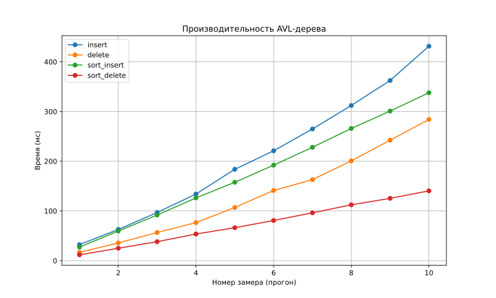
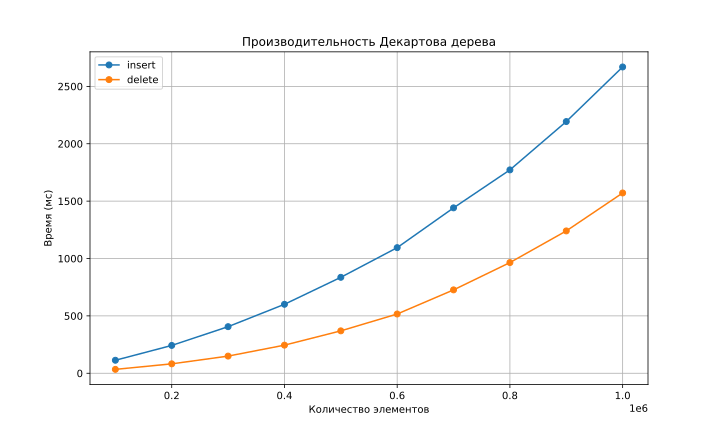
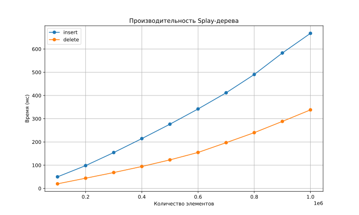
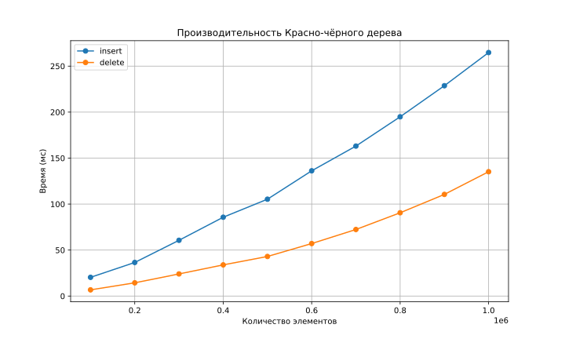
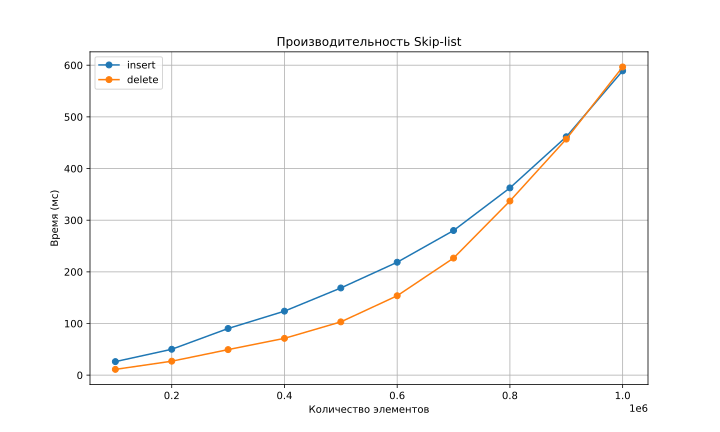

# Вывод по лабораторной работе №6: Сравнение деревьев

## 1. Рассмотренные виды деревьев

**Реализованные структуры:**
* **Part 1:** Наивное двоичное дерево поиска (BST)
* **Part 2:** AVL-дерево
* **Part 3:** Splay-дерево
* **Part 4:** Декартово дерево (Treap)
* **Part 5:** Красно-черное дерево (RB-Tree)
* **Part 7:** Skip-list

---

## 2. Анализ производительности BST (Part 1)
В первой части работы наглядно видно, что при вставке отсортированных данных, производительность сильно снижается (из-за превращения дерева в бамбук).

### Результаты замеров (среднее из 5 прогонов):
| Test case | Время выполнения (мс) |
| :--- | :--- |
| **Вставка (случайная)** | 22.766940 |
| **Удаление (случайное)** | 8.884570 |
| **Вставка (отсортированная)** | 420.664200 |
| **Удаление (отсортированное)** | 202.633200 |

**Вывод:** При работе с отсортированными данными, время вставки увеличивается более чем в **18 раз**. Это подтверждает необходимость использования балансировки, для поддержания высоты дерева $O(\log n)$ и сохранения производительности структуры.

---

## 3. Сбалансированные деревья (AVL, Splay, Treap, RB-Tree)
Для этих структур данных графики показывают стабильную зависимость времени от количества элементов, хотя и производительность разных структур достаточно сильно отличается. Но, в общем, и вставка, и удаление работают эффективно.

### AVL-дерево

### Декартово дерево (Treap)

### Splay-дерево

### Красно-чёрное дерево

Можем сделать вывод, что, в действительности, Красно-чёрное дерево работает быстрее остальных, сопоставимо работают AVL и Splay, а Декартач проигрывает. Связано это вероятно с тем, что Красно-чёрное дерево не зависит от случайных величин и не зависит от запрашиваемых чисел (которые тоже случайны), поэтому в общем случае оно обгоняет Декартач и Splay.

Оптимальным выбором является AVL-дерево, так как оно показывает хорошую производительность и пишется намного проще Красно-чёрного дерева.

---

## 4. Skip-list (Part 7)
Skip-list показал результаты, сопоставимые со сбалансированными деревьями на операциях вставки, однако на операциях удаления видимо что-то пошло не так.

Операция удаления для $5 \cdot 10^5$ элементов заняла примерно столько же времени, сколько вставка для $10^6$ элементов. Возможно, это связано с более плотным заполнением структуры для больших данных.

---

## 5. Общие выводы
1. **Балансировка критична:** Переход от BST к сбалансированным деревьям устраняет риск снижения производительности в зависимости от входных данных.
2. **Skip-list работает быстро:** Несмотря на свою легкую реализацию он показывает очень хорошую скорость.
3. **Эффективность удаления:** В большинстве протестированных структур удаление происходит быстрее вставки, за исключением Skip-list, где эти операции сопоставимы для большого объёма входных данных.