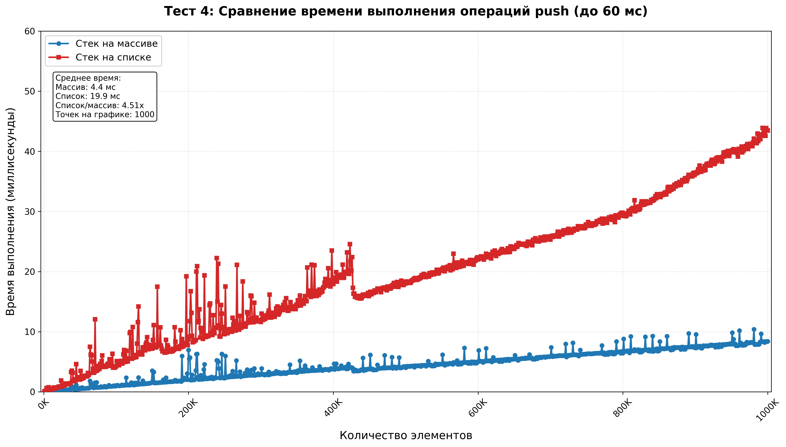
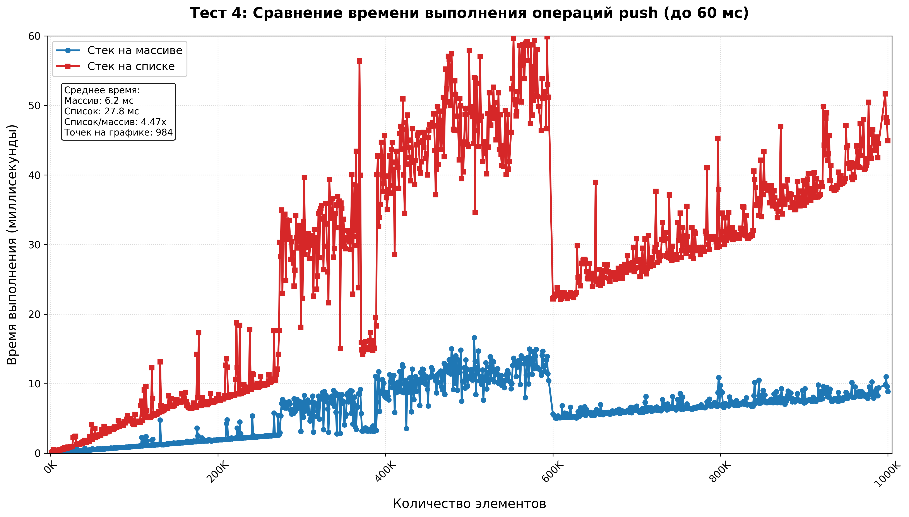
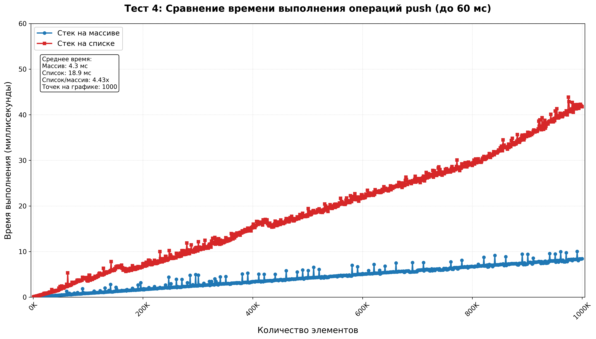
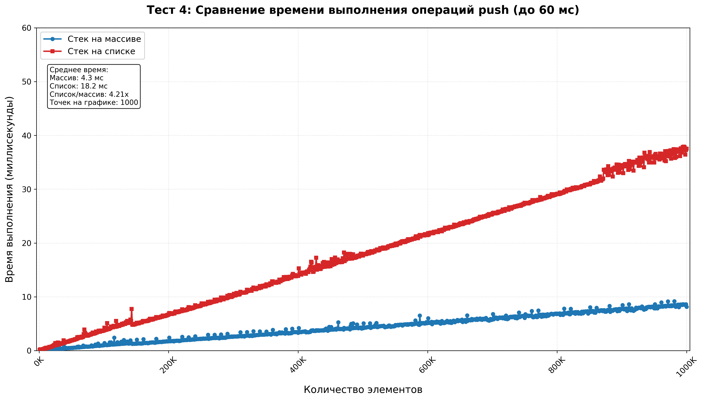

# Сравнение работы стеков, основанных на динамическом массиве и односвязном списке

Цель работы: сравнить время работы двух стеков. У одного в основе лежит динамический массив, у другого односвязный список (сохранение предыдущего элемента)

## Запуск тестов

Чтобы запустить тесты запустите Python-скрипт ***stack.py***:

```cmd
> py stack.py
```

## Сравнения времени

Запустив программу несколько раз, можем убедиться, что стек на массиве работает заметно быстрее (4.4-4.5 раза) + скачки по времени не такие большие даже в худших случаях.

Первые три теста усредняются по 5 запускам. Тест 4 усредняется по 3-м запускам.

## Графики для Теста 4

3 графика без усреднения:







С усреднением:



## Вывод

По моему мнению, стек на динамическом массиве лучше.

Его плюсы: 

$\cdot$ во всех тестах работает быстрее

$\cdot$ имеет прямой доступ по индексу за ***O(1)*** 

$\cdot$ большинство операций не используют расширение или сужение заранее выделенного блока памяти (если заранее знаем, сколько элементов нам потребуется)

Его минусы:

$\cdot$ Для стека обладает излишней функциональностью (доступ к произвольному элементу по индексу)

$\cdot$ Вследствие излишней функциональности, менее тривиален, нежели список (для стека)

Возможно, в реальной задаче разница во времени даже в 4-5 раз может оказаться несущественной, тогда стоит выбирать стек на односвязном списке, так как он обладает трививальной для понимания структурой и его легче написать.