# Сравнение сортировок

В ходе работы сравнивалось быстродействие различных сортировок, на "случайных" тестах.

## Part 0 

### Генерация тестов

Все файлы для генерации и запуска тестов находятся в папках `test-gen-utils` и `test-gens`.

В `test-gen-utils` лежат файлы для генерации одного теста - `test-gen.py` (для генерации случайных чисел, используется `randint`), поиска ответа на этом тесте - `test-sort.c` (для сортировки используется стандартный `qsort`) и bash-скрипта, который делает оба этих действия - `test-gen.sh` для нужных размеров массива и ограничения на число (в качестве аргументов принимает `from`, `to`, `step`).

В папке `test-gens` расположены bash-скрипты `gen-big.sh`, `gen-dub.sh`, `gen-small`, которые соответственно генерируют большие тесты (в папку `big_tests`),  генерируют тесты с большим количеством дубликатов (в папку `test_most_dublicates`), генерируют маленькие тесты (в папку `small_tests`) (под генерацией уже подразумевается создание и самого теста и ответа на него в файлы `.in` и `.out` соответственно). 

### Запуск сортировок

В файле `testing.h` расположена функция для тестирования сортировок `double* Test(const char* test_path, void (*func)(unsigned int*, int), int from, int to, int step)`, принимающая путь до файла, функцию, с помощью которой будем сортировать, `from`, `to`, `step`. Возвращает список времён, затраченных на сортировку каждого из тестов.

Программа `tester.c` принимает в качестве аргумента командной строки номер части, которую нужно выполнить, либо выполняет *10*-ю часть по умолчанию. Это программа содержит функцию `SaveResults`, которая как раз записывает в нужные файлы в папку `partN` данные о потраченном времени на тестах (`N` - номер части).

Сами сортировки расположены в header-файлах, которые подключаются в `tester.c`.

### Генерация графиков

В папке `plot-gens`, расположены python-скрипты в виде `partN-plot.py` для генерации графиков по файлам, созданным функцией `SaveResults`. Графики сохраняются в папке `partN`.

**!!!** Будьте аккуратны, `README` использует графики из папок `partN`, так что при перерисовке графиков `README` также поменяется.

### Запуск всей части целиком

В папке `parts-sh`, расположены bash-скрипты в виде `partN.sh`, для полноценного запуска всех этапов каждой из частей (кроме перегенерации тестов, для этого необходимо указать флаг `-g`, но перегенерируются только тесты необходимые этой части).

## Part 1

Header с сортировками: `small-sortings.h`

В этой части были протестированы квадратичные (и некоторые не совсем квадратичные) сортировки. 

Было получено два графика - первый для сравнения сортировок, второй для сравнения разновидностей Shellsort:

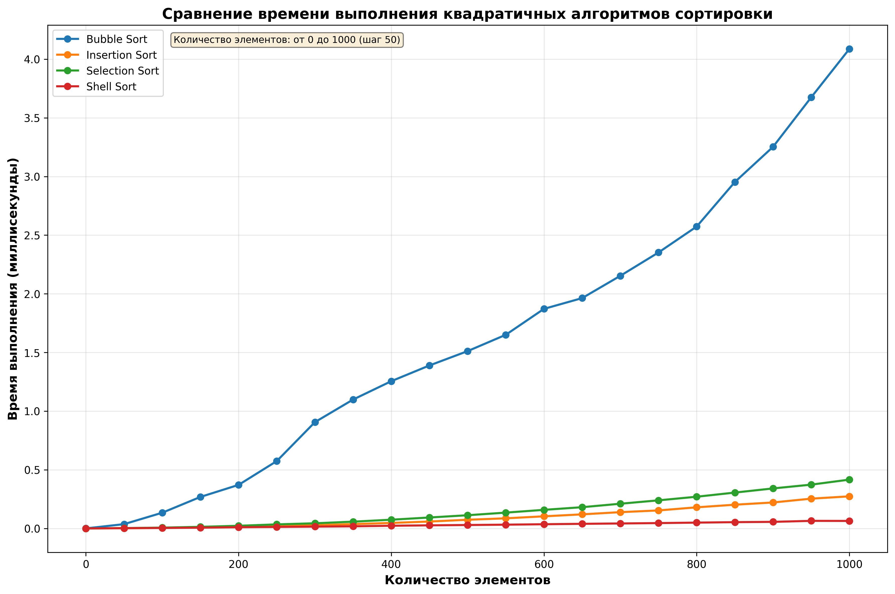

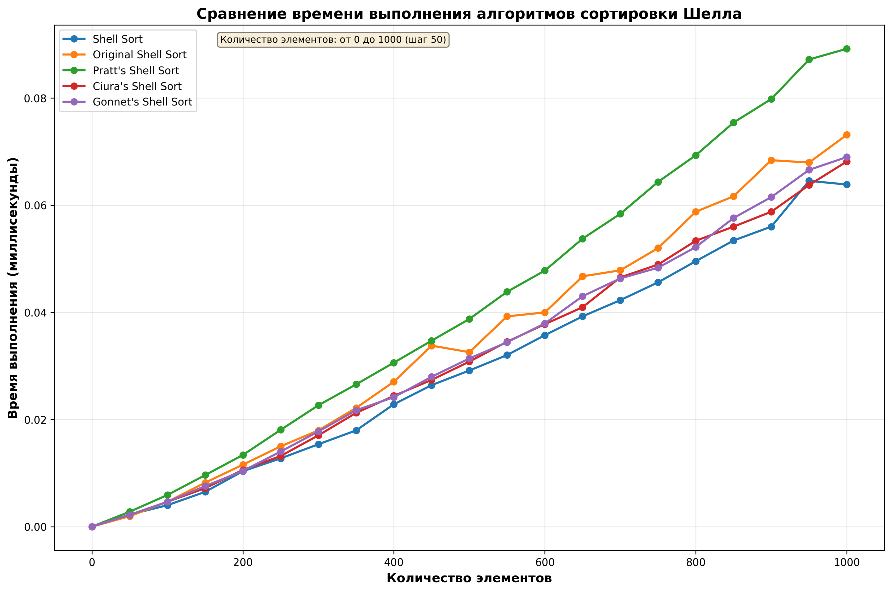

По первому графику можем сделать вывод, что как и предполагалось самой быстрой окажется Shell sort, а самой медленной пузырьковая. Все соответствует предполагаемым асимптотикам.

По второму графику также можем отметить, что использованная еще в первом графике Shell sort с разбиением Кнута также в среднем быстрее остальных. Кроме асипмтотик также это связано с небольшим размером входных данных (до *1000*), так как при небольших *n*, $n^{4/3}$ не так сильно отличается от *n*. 

## Part 2

Header с сортировками: `heap-sortings.h`

В этой части была исследована Bottom-up Heap sort с разными значениями количество детей для кучи(от *2* до *10*):

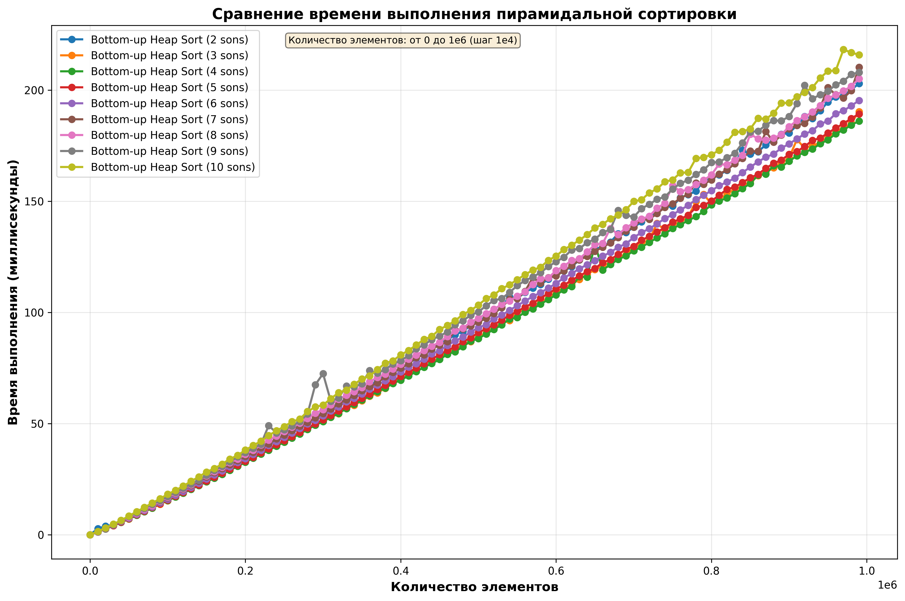

По графику, можем сделать вывод, что самой оптимальной оказалась куча с *4*-мя детьми. Если оценивать асимптотически, на *k*-ичной куче ожидается асимптотика $nklog_k n$, следовательно при больших *k* не получим выигрыша относительно бинарной кучи, так как *log* не будет отличаться в *5* раз, так что можем предположить, что поэтому *4* и является оптимальным количеством.

## Part 3

Header с сортировками: `merge-sortings.h`

В этой части мы сравнивали 2 сортировки слиянием: рекурсивную и нерекурсивную:

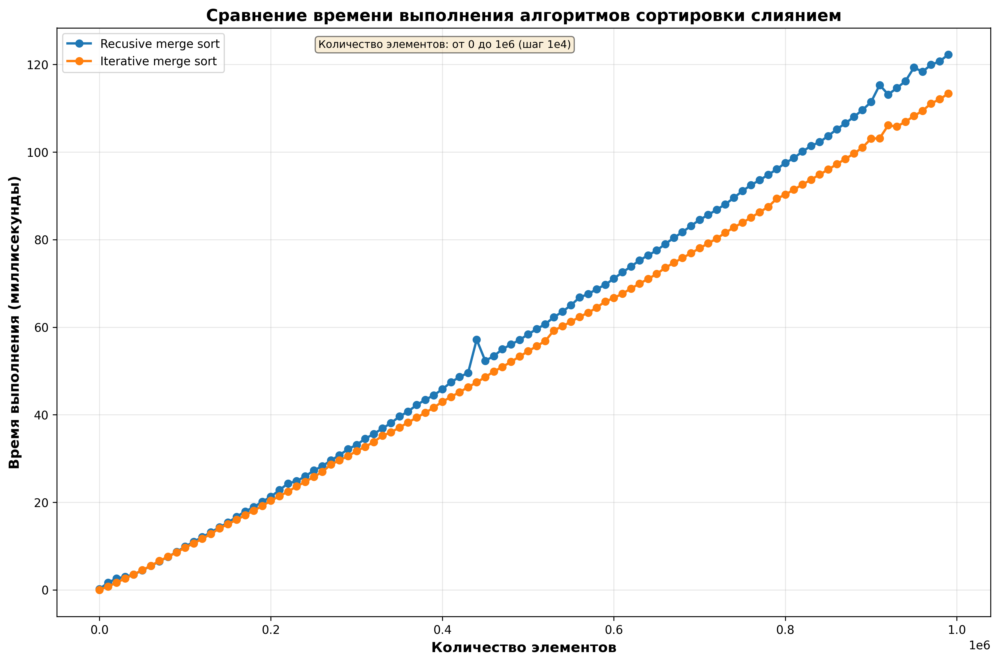

По полученном графику можем сделать вывод, что нерекурсивная версия работает быстрее, вероятно из-за накладных расходов на вызовы функций и возвраты из них в рекурсивной версии.

## Part 4

Header с сортировками: `part-sortings.h`

В этой части сравнивались различные алгоритмы быстрых сортировок.

Были получены два графика:

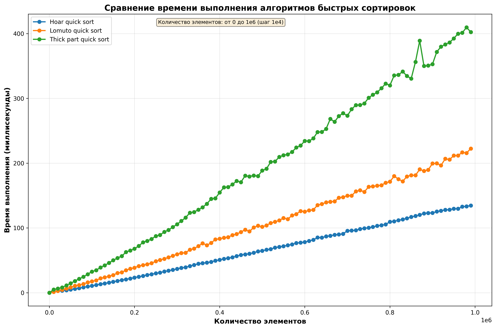

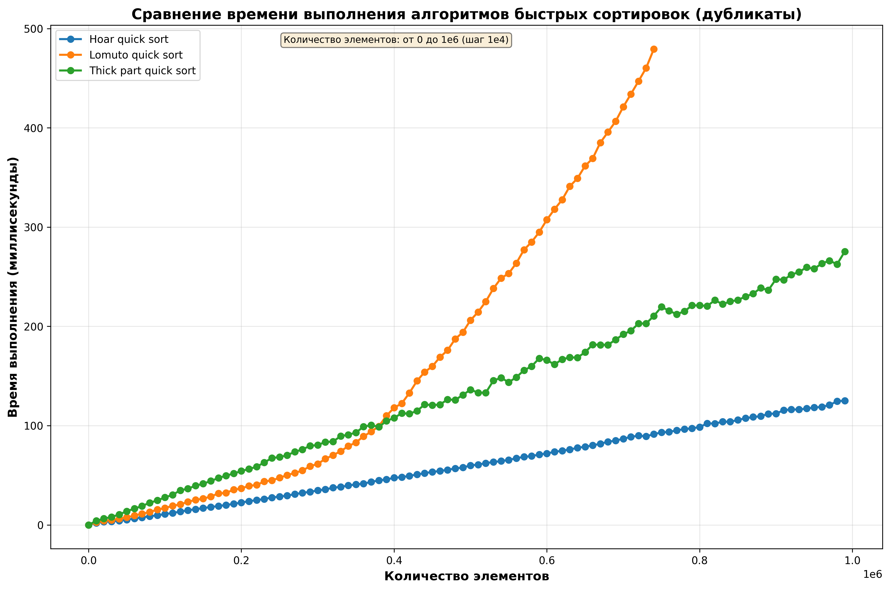

Функция быстрой сортировки написана так, что она принимает также функцию разбиения и функцию выбора pivot. Для толстого разбиения в этой функции был выделен отдельный случай. Также для блоков размера *32* и меньше используется сортировка вставками (из [Part 1](#part-1))

По получившимся графикам можем сделать вывод, что в обоих случая сортировка Хоара оказалась лучшей, как и предполагалось (в последующих частях именно она будет выбрана, как лучшая из быстрых сортировок). 

Также стоит отметить, что в случае дубликатов, сортировка с разбиением Ломуто работала очень долго и даже переполняла стек рекурсии (поэтому при собственноручной проверке рекомендуется запускать каждую из сортировок на каждом из тестов отдельно - в `tester.c` в `Part4()` они уже разбиты с помощью `return`-ов). Поэтому для неё были протестированы массивы с размером до *750000*.

## Part 5

Header с сортировками: `part-sortings.h`

В этой части была протестирована быстрая сортировка Хоара с различными стратегиями выбора pivot:

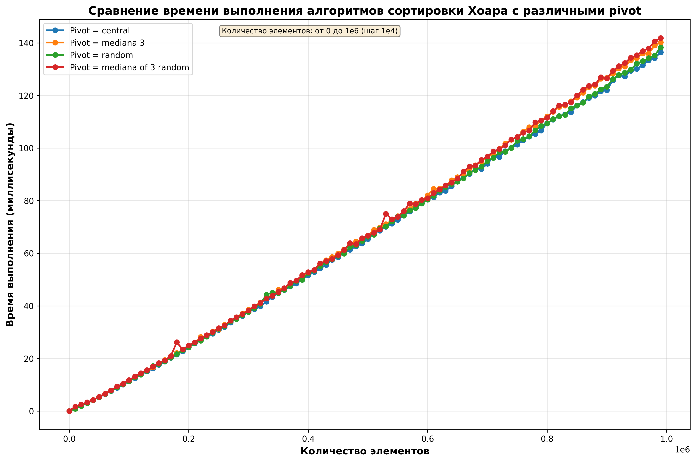

Запускалась сортировка Хоара из [Part 4](#part-4). По графикам можем сделать вывод, что все разбиения работают по времени примерно одинаково. Стоит учесть, что хоть и самой быстрой оказалась сортировка с выбором центрального в качестве pivot, для неё существуют контрпримеры, на которых она будет работать как квадратичная. Среди остальных лучшей оказалась с выбором случайного. Вероятно, её и стоит использовать в большинстве случаев.

## Part 6

Header с сортировками: `hoar-shell.h`

В этой части была протестирована сортировка Хоара с обработкой сортировкой Шелла не небольших блоках (в ходе тестирования меняли размер блока):

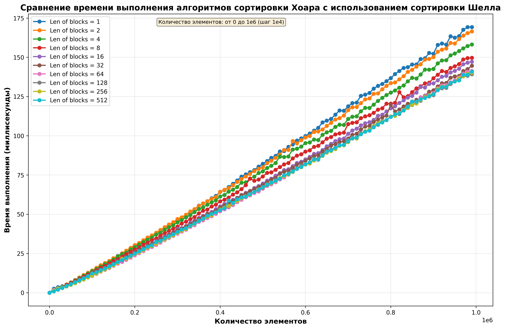

Оптимальным оказался размер блока *128*. Он опять же является не сильно маленьким (большая глубина рекурсии) и не сильно большим (чтобы Shellsort работала не долго).

## Part 7

Header с сортировками: `intro-sort.h`

В этой части сравнивались Introsort (с оптимальной кучей) и быстрая сортировка.

Сначала было найдено оптимальное количество сыновей для кучи:

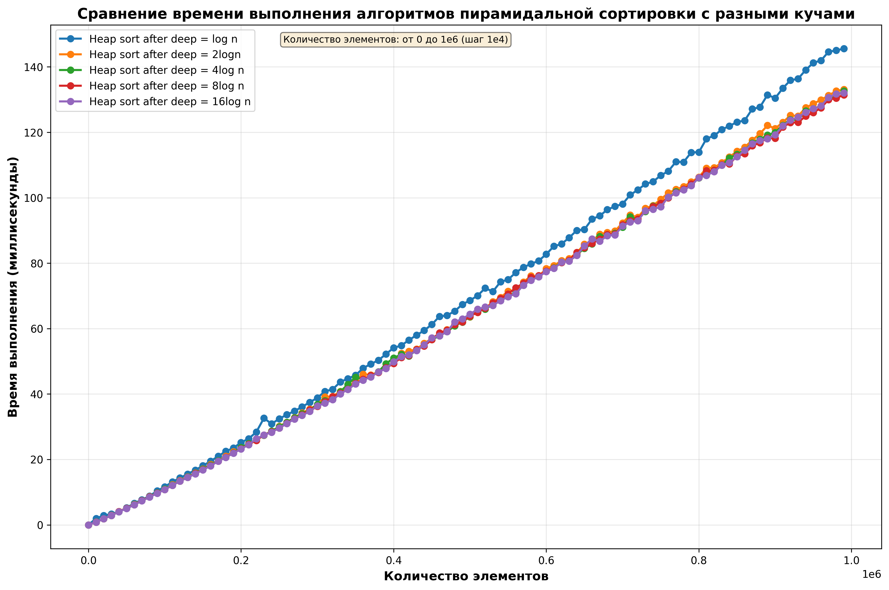

Затем куча с оптимальным размером использовалась в Introsort (pivot = central, hoar part.):

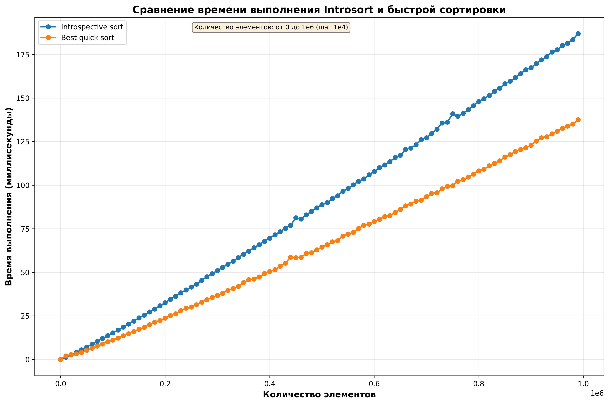

Тем не менее, хотя асимптотически Introsort должна была стать более выгодной, сортировка Хоара все же её обогнала. Связано это вероятно с тем, что все же пирамидальная сортировка все равно достаточно долгая.

## Part 9

Header с сортировками: `not-comp-sorts.h`

В этой части сравнивались две сортировки, не основанные на сравнениях - LSD sort и MSD sort.

Получили график:

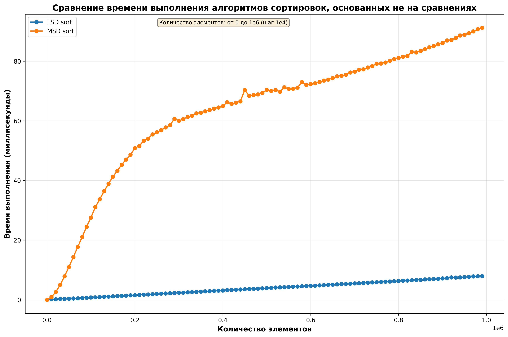

LSD sort отработала намного лучше, что вероятно связано с ей простотой и рекурсией, используемой в MSD sort.

## Part 10 (Вывод)

Header с сортировками: `base-quick-sort.h` (функия с вызовом библиотечной quick_sort, подстроенный под формат остальных функций сортировки).

В этой части сравнивались лучшие сортировки из каждой части и стандартная quick_sort. Был получен результат:

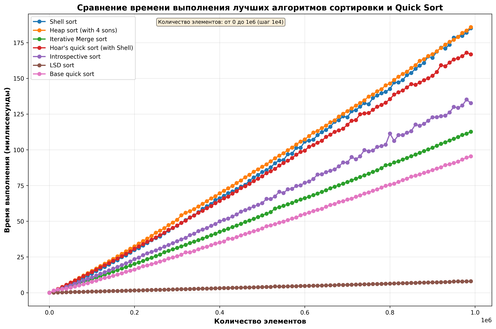

Получается, что удалось обогнать стандартную сортировку с помощью использования LSD sort. Также нерекурсивная версия Merge sort показала очень хороший результат близкий к библиотечной функции.

Достаточно логично, что LSD sort обогнала библиотечную функцию (причем сильно), так как у неё линейное время работы. Также вполне понятно, что, благодаря неиспользованию рекурсии, нерекурсивная версия Merge sort была близка к quick sort.

Как итог, можем сделать вывод, что сортировки, основанные на сравнениях работают дольше сортировок, не основанных на сравнениях, при этом часто в них используется рекурсия, что как показало исследование совсем не способствует их быстродействию. 

По моему мнению, золотой серединой всех этих сортировок является нерекурсиваня версия Merge sort, так как она близка в скорости к библиотечной, не использует рекурсии, проста в понимании и легко пишется (по сравнению с той же Introsort, которая, кстати, тоже удивительно быстро отработала). Хотя если ограничения позволяют отказаться от сортировок, основанных на сравнениях, стоит это сделать.
