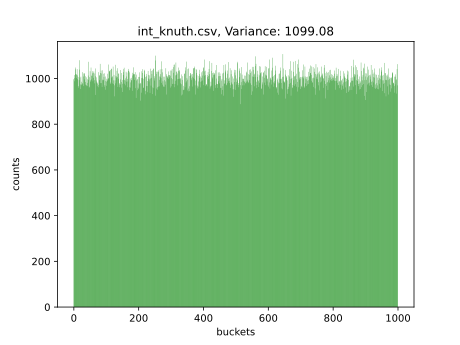
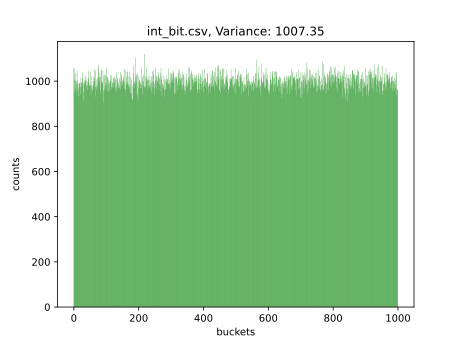
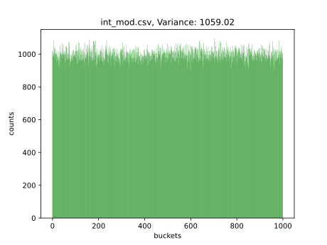
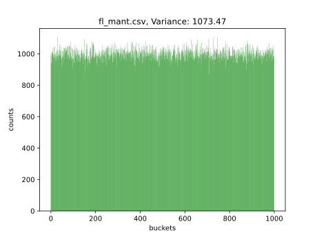
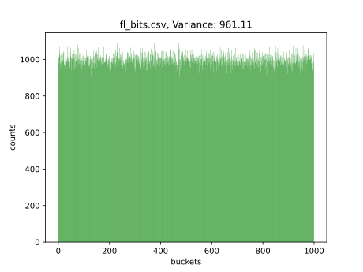
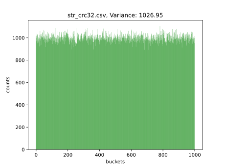
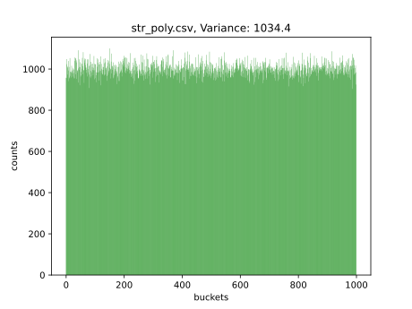
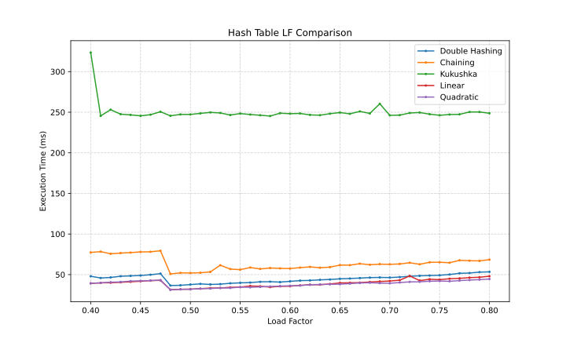
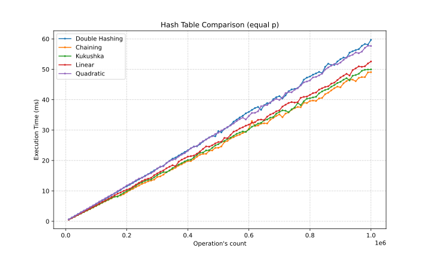
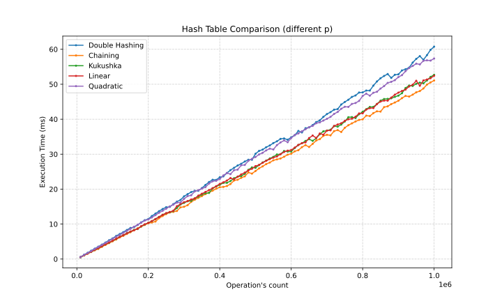

# Лабораторная работа №5: Хеширование

## Реализованные структуры и методы

### 1. Хеширование различных типов данных
В папке `plots/` представлены результаты распределения для следующих типов данных и хеш-функций (сами хеш-функции в `hash_func.c`):
* **Целые числа:** остаток от деления, битовое представление, метод Кнута.
* **Числа с плавающей точкой:** преобразование к int, битовое представление, мантисса, экспонента, произведение мантиссы на экспоненту.
* **Строки:** длина строки, сумма букв, полиномиальный хеш, crc32.

### 2. Различные способы разрешения коллизий
В папке `hash_tables/` реализованы следующие хеш-таблицы:
* **Линейное хеширование:** `hash_table_lin.c`
* **Квадратичное хеширование:** `hash_table_sq.c`
* **Двойное хеширование:** `hash_table_2h.c`
* **Метод цепочек:** `hash_table_cep.c`
* **Хеширование кукушкой:** `hash_table_kuk.c`

### 3. Unit-тесты для тестирования хеш-таблиц

У `Makefile` есть цели для тестирования таблиц:
* **Линейное хеширование:** `unit_test_lin`
* **Квадратичное хеширование:** `unit_test_sq`
* **Двойное хеширование:** `unit_test_2h`
* **Метод цепочек:** `unit_test_cep`
* **Хеширование кукушкой:** `unit_test_kuk`

### 4. Остальные цели Makefile

Также у `Makefile` есть другие цели для каждой из частей задания: `hash_functions`, `load_testing`, `oper_comparison` соответственно.

## Хеш-функции

В папке `results/` после тестирования будут расположены `.csv`-файлы с результатами замеров и значением дисперсии для разных хеш-функций. Вот, пример результатов:

| Файл с результатами | Дисперсия |
| :---: | :---: |
| int_mod.csv    | 1059.02 |
| int_bit.csv    | 1007.35 |
| int_knuth.csv  | 1099.08 |
| | |
| fl_intbit.csv  |  54018715.56 |
| fl_bits.csv    |       961.11 |
| fl_mant.csv    |      1073.47 |
| fl_exp.csv     | 252053995.62 |
| fl_mul_me.csv  |    912158.84 |
| | |
| str_len.csv    | 61500773.87 |
| str_sum.csv    |    289421.9 |
| str_poly.csv   |      1034.4 |
| str_crc32.csv  |     1026.95 |

### Сравнение хеш-функций для целых чисел

Все способы оказались хорошими:

### Сравнение хеш-функций для вещественных чисел

Тут наиболее эффективными оказались хеширование по мантиссе и битовое представление:

### Сравнение хеш-функций для строк
Ниже приведены графики наиболее эффективных строковых хеш-функций.

## Сравнение различных load_factor

Имеем следующий результат:

Таким образом, получаем, что наиболее эфективен load_factor = 0.48. Его и будем использовать.

## Сравнение различных хеш-таблиц

Проведены сравнения для случая равновероятных операций Вставки, Поиска и Удаления:

И для случая преобладания операций Вставки (P(insert) = 0.5, P(search) = P(delete) = 0.25):

В обоих случаях метод цепочек показал лучший результат, похуже Кукушка и линейный метод, хуже всего метод Двойного хеширования и квадратичный метод. Во втором случае Кукушка сильнее приблизилась к методу цепочек, что странно, так как её сильная сторона - поиск, который в ней выполняется очень быстро.

## Выводы

1.  **Эффективность хеш-функций:** 
    * Для целых чисел все хеш-функции показали хороший результат. По моему мнению, наиболее удобный способ - метод Кнута, так как состоит из одного умножения и взятия по модулю.
    * Среди вещественных чисел удобно хеширование с помощью битового представления, так как используется просто перевод к int-ам и даёт наилучший результат.
    * Среди строковых функций наиболее надежным оказался crc32, минимизирующий дисперсию. При этом он удобен, так как есть библиотечные версии и даже intrinsic-и, что открывает возможность оптимизации.

2.  **Сравнение load-factor:**
    * Наиболее удачными оказались load-factor-ы близкие к 0.5. Вероятно это баланс между слишком пустой таблицей и перезаполненной (что не сильно благоприятно в случае открытого хеширования).

3.  **Сравнение методов разрешения коллизий:**
    * **Метод цепочек:** несмотря на затраты на указатели, показывает лучшие результаты, что в совокупности с простым написанием делают его лучшим среди остальных.
    * **Линейное хеширование:** также прост в написании, хотя даёт результаты похуже, зато все данные по сути лежат рядом и подряд.
    * **Хеширование кукушкой:** обеспечивает поиск $O(1)$ в худшем случае, однако требует удачных хеш-функций, чтобы избежать многократного Rehash-а при зацикливании вставок.
    * **Квадратичный метод** и **двойное хеширование** проигрывают по скорости.

